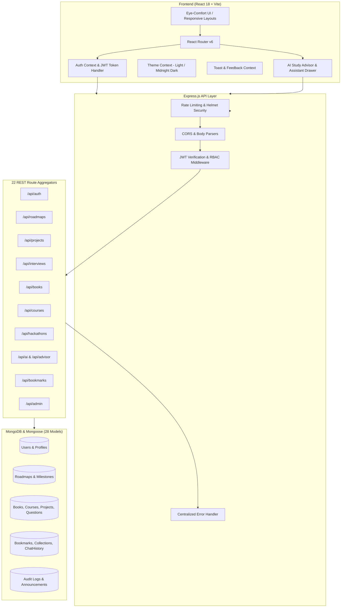

# 🎓 VidyaPath (વિદ્યાપથ) — CSE Career & Academic Ecosystem

> **Gyan Anupath • Learn • Plan • Grow**  
> A production-ready, centralized career, learning, and placement portal specifically engineered for Computer Science & Engineering (CSE) students.

[](https://reactjs.org/)
[](https://nodejs.org/)
[](https://www.mongodb.com/)
[](https://jwt.io/)
[](#-ui--eye-comfort-design-system)

---

## 📌 Table of Contents

- [🌟 Project Overview](#-project-overview)
- [✨ Key Features & Modules](#-key-features--modules)
  - [1. 🗺️ 4-Year CSE Academic & Career Roadmap](#1-️-4-year-cse-academic--career-roadmap)
  - [2. 🤖 AI Study Advisor & AI Career Studio](#2--ai-study-advisor--ai-career-studio)
  - [3. 💼 Placement Hub & Interview Practice](#3--placement-hub--interview-practice)
  - [4. 🚀 Industry Projects Hub & Master Guides](#4--industry-projects-hub--master-guides)
  - [5. 🏆 Hackathons & Master Playbook](#5--hackathons--master-playbook)
  - [6. 📚 Standard Textbooks & Curated Syllabus Notes](#6--standard-textbooks--curated-syllabus-notes)
  - [7. 🎓 Online Courses & YouTube Learning Hub](#7--online-courses--youtube-learning-hub)
  - [8. 📄 ATS Resume Guide & Live Resume Builder](#8--ats-resume-guide--live-resume-builder)
  - [9. 🔖 Bookmarks & Custom Collections](#9--bookmarks--custom-collections)
  - [10. ⚡ Global Command-K Search & Announcements](#10--global-command-k-search--announcements)
  - [11. 🛡️ Admin Control Center & Analytics Dashboard](#11-️-admin-control-center--analytics-dashboard)
- [🎨 UI & Eye-Comfort Design System](#-ui--eye-comfort-design-system)
- [🏗️ System Architecture](#️-system-architecture)
- [🛠️ Technology Stack](#️-technology-stack)
- [📂 Project Directory Structure](#-project-directory-structure)
- [🔌 API Endpoints Summary](#-api-endpoints-summary)
- [🚀 Quick Start & Installation](#-quick-start--installation)
  - [Prerequisites](#prerequisites)
  - [1. Backend Setup](#1-backend-setup)
  - [2. Frontend Setup](#2-frontend-setup)
  - [3. Seeding Initial Data](#3-seeding-initial-data)
- [🔐 Authentication & Roles](#-authentication--roles)
- [📜 License & Credits](#-license--credits)

---

## 🌟 Project Overview

**VidyaPath** is an all-in-one digital companion for Computer Science & Engineering students across all 4 academic years (8 Semesters). It bridges the gap between traditional university syllabus and modern industry demands by providing:

1. **Structured Guidance**: Step-by-step roadmaps from Year 1 fundamentals to Year 4 placement readiness and specialized tracks (Full-Stack, AI/ML, Cybersecurity, Cloud/DevOps, Data Science).
2. **AI-Powered Mentorship**: Intelligent AI career advisors and interactive assistant studios providing real-time code explanations, interview practice, resume audits, and curated study paths.
3. **Curated Academic & Placement Resources**: Authentic textbooks, video playlists, practice questions, capstone projects, and hackathon strategies in one unified interface.
4. **Ergonomic Eye-Comfort Experience**: High-contrast, low-glare warm slate design system engineered specifically for long study and coding sessions in both Light and Midnight Dark modes.

---

## ✨ Key Features & Modules

### 1. 🗺️ 4-Year CSE Academic & Career Roadmap
- **Semester-Wise Progression (Sem 1 to Sem 8)**: Detailed subjects, practical milestones, and recommended project checkpoints.
- **Core CS Foundations**: Discrete Maths, Data Structures & Algorithms, OS, DBMS, Computer Networks, and System Design.
- **5 Industry Specialization Tracks**:
  - *Full-Stack / Software Engineering*
  - *AI / Machine Learning & Data Science*
  - *Cybersecurity & Defensive Engineering*
  - *Cloud Architecture & DevOps (SRE)*
  - *Data Engineering & Analytics*
- Interactive milestone tracking with completion status.

### 2. 🤖 AI Study Advisor & AI Career Studio
- **AI Study Advisor**: Evaluates student profile, target job roles, current semester, and skill gaps to generate personalized step-by-step weekly study plans.
- **AI Career Studio Drawer**: Floating quick-access assistant with 5 specialized conversation modes:
  - 💬 *General Guidance*
  - 💻 *Code Helper & Debugger*
  - 🎯 *Interview & DSA Mock Q&A*
  - 📝 *ATS Resume & Bullet Point Polish*
  - 🚀 *Project Architecture & Tech Stack Ideation*

### 3. 💼 Placement Hub & Interview Practice
- **Company-Wise Placement Patterns**: Syllabus, hiring workflows, online test patterns, and interview rounds for Product (FAANG/Tier-1), Service, and High-Growth Startups.
- **DSA Question Bank**: Blind 75 / NeetCode 150 style categorized problem bank with difficulty filters, problem tags, and complete solution walkthroughs with code snippets.
- **Core CS Interview Practice**: Flashcard-style collapsible Q&A for OS, DBMS, SQL, OOP, and Networks.

### 4. 🚀 Industry Projects Hub & Master Guides
- **Tier-1 / Tier-2 / Tier-3 Projects**: Real-world project blueprints spanning Full-Stack MERN/Next.js, AI/ML pipelines, Cloud Microservices, and Blockchain.
- **Architecture Breakdowns**: System design blueprints, tech stack justifications, database schemas, and GitHub starter repository links.

### 5. 🏆 Hackathons & Master Playbook
- **Active Hackathon Radar**: Smart India Hackathon (SIH), MLH, Devpost, and local college hackathons with deadlines and registration links.
- **22-Step Hackathon Student Master Playbook**: Comprehensive engineering & pitch handbook covering:
  - *Problem Discovery & Root Cause Analysis*
  - *Golden Path MVP Scope*
  - *High-Impact PPT Slide Deck Strategy*
  - *3-Minute Winning Pitch Formula*
  - *Judge Q&A Defensive Tactics*

### 6. 📚 Standard Textbooks & Curated Syllabus Notes
- **Authentic Subject Textbooks**: Cormen (CLRS), Galvin (OS), Korth (DBMS), Tanenbaum/Kurose (CN), Pressman (SE).
- Filter by semester, subject tag, author, and reading recommendations.
- Direct PDF links, syllabus references, and university notes repository.

### 7. 🎓 Online Courses & YouTube Learning Hub
- **4-Year Coursera & Certification Guide**: Categorized free and audit-friendly certifications (NPTEL, Coursera, edX, Harvard CS50).
- **Top YouTube Channel Curation**: Categorized video playlists for every subject (Striver, Abdul Bari, Traversy Media, freeCodeCamp, MIT OpenCourseWare).

### 8. 📄 ATS Resume Guide & Live Resume Builder
- **ATS Resume Master Guide**: Formatting rules, action verb library, impact measurement formulas ($X-Y-Z$), and common fresher pitfalls.
- **Interactive Live Resume Builder**:
  - Live split-view real-time resume preview.
  - Section-by-section builder: Header, Education, Skills, Work/Internship, Projects, Certifications.
  - One-click print/PDF export.

### 9. 🔖 Bookmarks & Custom Collections
- Bookmark any project, book, course, interview question, or YouTube resource across the entire platform.
- Create custom named collections (e.g., *"My Sem 5 Exam Prep"*, *"Google Placement Revision"*).

### 10. ⚡ Global Command-K Search & Announcements
- **Quick Command Palette (`Ctrl + K` / `Cmd + K`)**: Instant fuzzy search across all resources, roadmaps, books, and interview topics.
- **Departmental Announcements**: Placement notices, hackathon alerts, and campus exam schedules with priority tags.

### 11. 🛡️ Admin Control Center & Analytics Dashboard
- Comprehensive metrics: Total registered students, active bookmarks, published resources, and daily query volume.
- **Full CRUD Management**: Add, update, or remove Books, Courses, Projects, Hackathons, and Interview Questions.
- User management and system audit logs with role delegation.

---

## 🎨 UI & Eye-Comfort Design System

VidyaPath features a custom-engineered **Ergonomic Eye-Comfort Design System**:

| Element | Light Mode (Warm Slate) | Dark Mode (Midnight Slate) |
|---|---|---|
| **Base Canvas** | `#F8FAFC` (Soft Warm Slate - 0% Glare) | `#0B0F19` (Restful Midnight Obsidian) |
| **Card Surfaces** | `#FFFFFF` (Pure Crisp White) | `#111827` (Deep Slate Container) |
| **Borders** | `#E2E8F0` (Calm Slate Border) | `#273549` (Subtle Muted Border) |
| **Primary Typography** | `#0F172A` (Charcoal Slate - High Legibility) | `#F8FAFC` (Luminous Crisp White) |
| **Brand Accent** | `#312E81` / `#4F46E5` (Royal Indigo) | `#6366F1` / `#818CF8` (Soft Indigo Tint) |
| **Shadows** | Soft Neutral Diffused (`rgba(15, 23, 42, 0.06)`) | Deep Natural Obsidian (`rgba(0, 0, 0, 0.4)`) |

---

## 🏗️ System Architecture



---

## 🛠️ Technology Stack

### Frontend
- **Core**: React 18, JavaScript (ES6+), HTML5 Semantic Structure
- **Build Tool**: Vite 6.x
- **Routing**: React Router DOM v6
- **Icons**: Lucide React
- **Styling**: Vanilla CSS Design System with CSS Custom Properties (Variables), Flexbox/Grid, and Fluid Typography
- **Deployment**: Vercel / Netlify (`vercel.json`, `netlify.toml`)

### Backend
- **Runtime**: Node.js (v18+)
- **Framework**: Express.js
- **Database**: MongoDB with Mongoose ODM
- **Authentication**: JSON Web Tokens (JWT) & bcryptjs Password Hashing
- **Security**: Helmet, CORS, Express Rate Limit, Input Sanitization
- **Logging & Utilities**: Standardized API response envelopes, Custom `AppError` operational error classes

---

## 📂 Project Directory Structure

```
CSE_career/
├── frontend/                     # React Frontend Application
│   ├── src/
│   │   ├── assets/               # Brand assets and logo images
│   │   ├── components/
│   │   │   ├── ai/               # AI Chat, Drawer, and Advisor widgets
│   │   │   ├── common/           # Button, Card, Badge, Modal, Search, Logo
│   │   │   ├── feedback/         # EmptyState, ErrorState, Toast, Loading
│   │   │   ├── hackathons/       # Hackathon playbook data & master views
│   │   │   ├── navigation/       # Navbar, Sidebar, Footer, Mobile Drawer
│   │   │   ├── placement/        # Company cards, placement guides
│   │   │   ├── projects/         # Project cards, industry project guide
│   │   │   ├── resume/           # Resume builder form & live sheet preview
│   │   │   ├── roadmap/          # Year tabs, milestone cards, timeline
│   │   │   └── coursera/         # Online course guides & certifications
│   │   ├── constants/            # App configuration, routes, storage keys
│   │   ├── context/              # Auth, Theme, Toast, User Contexts
│   │   ├── hooks/                # useAuth, useTheme, useNotifications, useSearch
│   │   ├── layouts/              # MainLayout, AuthLayout, ProtectedRoute
│   │   ├── pages/                # 28 Page Components (Dashboard, Roadmap, Books, etc.)
│   │   ├── services/             # Axios API service clients (auth, bookmarks, etc.)
│   │   ├── styles/               # Design system: variables.css, components.css, pages.css, layout.css
│   │   ├── utils/                # Date formatters, error helpers, validators
│   │   ├── App.jsx               # Application router & provider setup
│   │   └── main.jsx              # DOM entrypoint
│   ├── index.html
│   ├── package.json
│   └── vite.config.js
│
├── backend/                      # Node.js & Express REST API Server
│   ├── src/
│   │   ├── config/               # Database connection (Mongoose) & env validator
│   │   ├── constants/            # HTTP status codes, user roles, error types
│   │   ├── controllers/          # Business logic controllers (Auth, Books, Projects, Admin, etc.)
│   │   ├── data/                 # Static fallback knowledge & curriculum datasets
│   │   ├── middleware/           # auth, rbac, errorHandler, notFound, rateLimiter
│   │   ├── models/               # 28 Mongoose Schemas (User, Book, Project, Roadmap, etc.)
│   │   ├── routes/               # 22 REST Route modules & master router aggregator
│   │   ├── seed/                 # Database seeder scripts (Roadmap, Books, Questions, Admin)
│   │   ├── services/             # Domain services (AIService, AuthService, BookmarkService)
│   │   ├── utils/                # apiResponse envelope, appError class
│   │   ├── validators/           # Request schema & payload validation
│   │   └── app.js                # Express application configuration
│   ├── server.js                 # Server listener & graceful shutdown handlers
│   ├── package.json
│   ├── .env.example
│   └── README.md
│
├── vercel.json                   # Vercel Deployment Configuration
├── netlify.toml                  # Netlify Deployment Configuration
└── README.md                     # Root Project Documentation
```

---

## 🔌 API Endpoints Summary

| Module | Method & Endpoint | Access | Description |
|---|---|---|---|
| **Health** | `GET /api/health` | Public | Server uptime & DB connection health |
| **Auth** | `POST /api/auth/register` | Public | Register a new student account |
| **Auth** | `POST /api/auth/login` | Public | Login & receive JWT access token |
| **Auth** | `GET /api/auth/me` | Authenticated | Retrieve current user profile |
| **Roadmaps** | `GET /api/roadmaps` | Public | Get all 4-year CSE roadmaps & milestones |
| **Roadmaps** | `GET /api/roadmaps/:id` | Public | Get specific roadmap details & semester plan |
| **Projects** | `GET /api/projects` | Public | List industry capstone projects with filters |
| **Projects** | `GET /api/projects/:id` | Public | Get project architecture & repo details |
| **Interviews** | `GET /api/interviews` | Public | Get DSA & CS core interview question bank |
| **Books** | `GET /api/books` | Public | Get standard textbooks sorted by semester |
| **Courses** | `GET /api/courses` | Public | Get curated online certifications |
| **Hackathons** | `GET /api/hackathons` | Public | List active hackathons & guidelines |
| **YouTube** | `GET /api/youtube` | Public | Get curated domain playlists |
| **AI Studio** | `POST /api/ai/chat` | Authenticated | Send prompt to AI Career Assistant |
| **AI Advisor**| `POST /api/advisor/plan` | Authenticated | Generate tailored semester study plan |
| **Bookmarks** | `GET /api/bookmarks` | Authenticated | Get user's saved items |
| **Bookmarks** | `POST /api/bookmarks` | Authenticated | Save a new item to bookmarks |
| **Bookmarks** | `DELETE /api/bookmarks/:id` | Authenticated | Remove an item from bookmarks |
| **Collections**| `POST /api/bookmarks/collections` | Authenticated | Create custom named folder collection |
| **Resumes** | `GET /api/resumes` | Authenticated | Fetch saved resume data |
| **Resumes** | `PUT /api/resumes` | Authenticated | Save/update live resume profile |
| **Search** | `GET /api/search?q=:query` | Public | Global Command-K fuzzy search |
| **Admin** | `GET /api/admin/metrics` | Admin | Get platform analytics & user counts |
| **Admin** | `POST /api/admin/resources` | Admin | Add a new platform resource (Book/Project/Q) |

---

## 🚀 Quick Start & Installation

### Prerequisites
- **Node.js** (v18.0.0 or higher)
- **npm** (v9.0.0 or higher)
- **MongoDB** (Local instance running at `mongodb://localhost:27017` or a MongoDB Atlas URI)

---

### 1. Backend Setup

```bash
# 1. Navigate to backend directory
cd backend

# 2. Install dependencies
npm install

# 3. Create .env file from template
cp .env.example .env

# 4. Configure your .env variables:
# PORT=5000
# MONGO_URI=mongodb://localhost:27017/cse_career_portal
# JWT_SECRET=your_super_secret_jwt_key
# JWT_EXPIRE=7d
# CORS_ORIGIN=http://localhost:5173

# 5. Start development server with auto-reload
npm run dev
```

*The backend server will start on `http://localhost:5000`.*

---

### 2. Frontend Setup

```bash
# 1. Open a new terminal and navigate to frontend directory
cd frontend

# 2. Install dependencies
npm install

# 3. Start Vite development server
npm run dev
```

*The frontend application will start on `http://localhost:5173`.*

---

### 3. Seeding Initial Data

To populate the database with complete 4-year roadmaps, standard textbooks, DSA questions, capstone projects, and an admin user:

```bash
cd backend
node src/seed/seedAll.js
```

---

## 🔐 Authentication & Roles

VidyaPath implements Role-Based Access Control (RBAC):

1. **Student (`role: 'student'`)**:
   - Access to personal dashboard, roadmap progress, AI assistant, resume builder, bookmarks, collections, and resource library.
2. **Admin (`role: 'admin'`)**:
   - All student features + Admin Control Center, platform telemetry metrics, resource publishing (CRUD), announcement broadcasting, and audit logging.

---

## 📜 License & Credits

- Developed for Computer Science & Engineering students.
- **CHARUSAT Vidyapath Ecosystem** • Learn • Plan • Grow.
- Built with ❤️ by the CSE Career Development Team.
